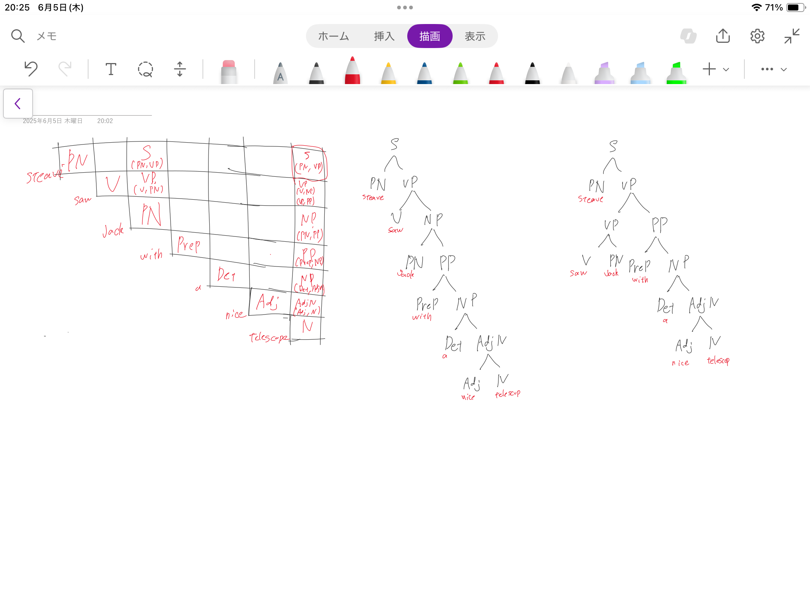

# 言語処理工学 中間レポート

2025年4月8日   
学籍番号：35714121   
名前：福富隆大   
 

## 1.曖昧な文

### 曖昧な文

彼女は本を読んでいる間に寝てしまった

### その理由

この例では文構造層での情報の不完全さが問題となっている。  
具体的には、「読んでいる間に」という修飾語句の係り受け関係が不明確。日本語では修飾語と被修飾語の関係が構造的に曖昧になりやすいという特性がある。  

解釈1: [彼女は[本を読んでいる]間に寝てしまった]  

* 彼女自身が本を読む行為をしていて、その最中に眠りに落ちた
* 主体と「読む」行為の実行者が同一人物

解釈2: [彼女は[（誰かが）本を読んでいる]間に寝てしまった]  

* 別の人が本を読んでいる時間帯に、彼女が眠りに落ちた
* 「読む」行為の実行者が文中に明示されていない

この曖昧性は意味層にも波及し、文全体として伝えようとする状況が複数存在することになる。受け手は文構造から意味を再構築する際に、どちらの解釈が適切かを判断する必要があるが、この文だけでは決定できない。  

## 2.生成 AI の活用方法

### (1) ふさわしくない使い方

一つ目は理論的理解を問う課題において、問題文をそのまま生成AIに入力し、出力された回答をコピーして提出する行為である。  
これは、大学の学修における本質の主体的に学ぶということをしていない。問題解決のプロセスを経験せず、思考力や応用力を養う機会を失っている。  
二つ目はグループワークにおいて、自分の担当部分を生成AIに生成させ、内容を理解しないままそれを提出することである。  
これは、「自分の代役といして使う」典型例であり、チームメンバーの一員としての責任を果たしていない。  
また、内容を確認しないことは生成AIの出力を無批判に採用することであり、誤った情報をチームに広めるリスクがある。  

### (2) ふさわしい使い方

ふさわしい使い方の一つは生成AIを使い理解できない概念や用語について調べることである。  
例えば、「再帰関数の概念がよく理解できないので、簡単な例と共に説明してほしい」や「このソートアルゴリズムの時間計算量がO(n log n)になる理由を説明してほしい」といった形で、自分の学習を深めるための補助として活用する。  
この方法では、生成AIを「代役」ではなく「教育的な対話相手」として位置づけている。学生は自分の理解度を把握した上で、不明点を明確にし、それに対する説明を求めることで、能動的な学習を促進できる。また、生成AIの回答に対しても批判的思考を持って接し、その内容の真偽や適切さを自分で判断する習慣を身につけることができる。  

## 3.形式文法 G

### (1)

NP → Det Adj N と NP → PN を削除して  
以下の変換規則を追加する  

* NP → Det AdjN
* AdjN → Adj N
* PP → Prep PN
* NP → PN PP 
* S → PN VP 
これにより

### (2)

#### 解析木と解釈

### (3)

#### 解釈した訳

1. スティーブは望遠鏡を持ったジャックを見た
2. スティーブは望遠鏡でジャックを見た
