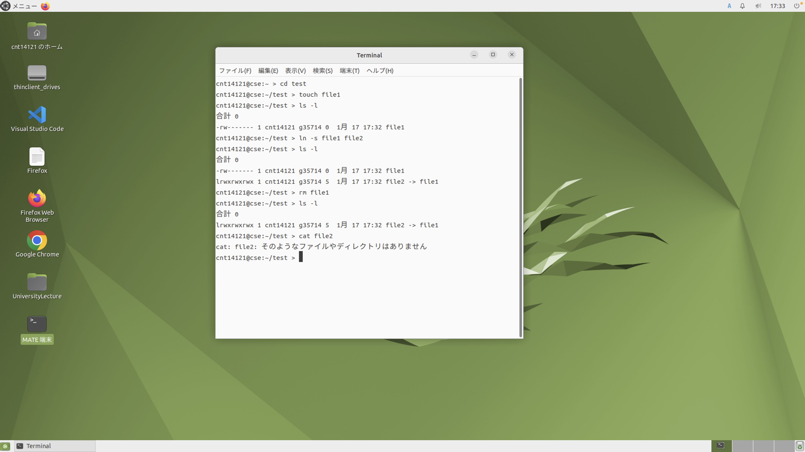
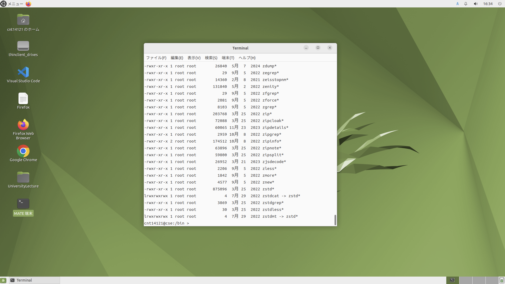

# OSレポート　　　2024年1月16日　学籍番号：3575121 氏名：福富隆大

## (13.1)図13.9,図13.11を実際に実行し、実行結果を添付しなさい。また実行結果について考察しなさい。またCSEにログインして、どこにハードリンク、シンボリックリンクが用いられているか見つけて、示しなさい。ヒント　/usr/bin, /usr/lib, /usr/sbin など /usr の下を探してください。またディレクトリの内容を表示するコマンドとして、 ls -l を使ってください  

### 図13.9,図13.11の実行結果  

  

### 考察  

touchコマンドでfail1を作成し、ln -sコマンドでfile1のシンボリックリンクとしてfile2を作成しています。  
ls -lコマンドの結果がfile2は１列目がlで始まっており、リンク名の後に->file1があることからも分かります。  
また、シンボリックリンクは他ファイルへの参照を持つという意味なので、参照先のfile1を削除した後はcatコマンドで内容を表示させることはできなくなっている。  

### ハードリンク、シンボリックリンクの用いられている箇所について  

画像はuser/binでls -lコマンドを実行した結果である。  
シンボリックリンクは１列目がlで始まっており、リンク名の後に->があるものなので、実行結果を見るとzstdcatなど がある。  
また、2列目が2となっているファイルは少なくとも一つのハードリンクが存在しているので、実行結果を見るとzipinfoなどがハードリンクを持っている。  

## (13.2)ディスクフラグメンテーションを２種類定義し、システム性能低下の定義（どのような性能低下か）と、解決方法についてについて、それぞれ説明しなさい

### 1. 固定長割り当て時のフラグメンテーション  

#### 定義  

データがディスク上に保存されるときに物理的に不連続になってしまうこと。  
データにアクセスするときにヘッドが頻繁に移動する必要がある場合がある。  

#### 解決法

デフラグツールを利用してデータの保存場所を再配置することで解決する。  
ただし、SSDの場合はデフラグが無意味どころかデフラグをすることで寿命を減らしてしまうので有害である。  

### 2. 連続領域割り当て時のフラグメンテーション  

#### 定義  

データは連続して保存されているが、新たにデータを保存する際にデータを保存するのに十分な連続したセクターを確保できないこと。  
十分な空き容量があるにも関わらず、ファイルを保存するには小さすぎる空き領域が増えてしまい実際には使えないということが起こる。  

#### 解決法

ページ化セグメンテーションを使用して使用できない空き容量をほぼ無視できる程度に抑えることで解決する。
また、デフラグツールでファイルの再配置をすることでも解決できる（SSDでの注意点は同じ）。
