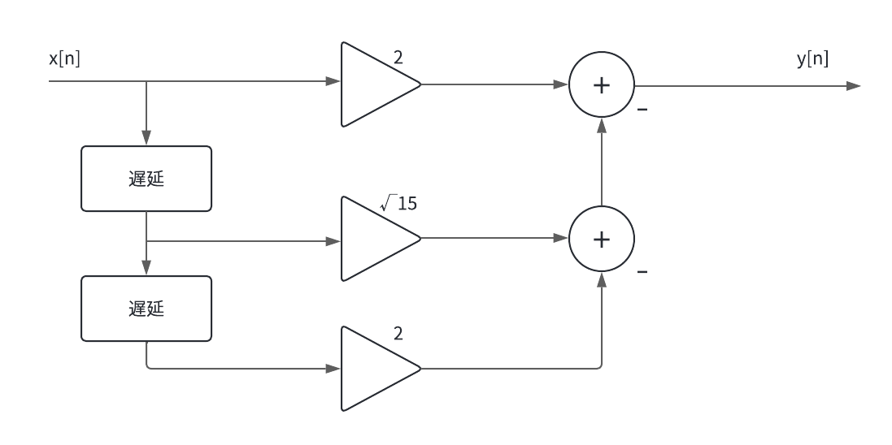
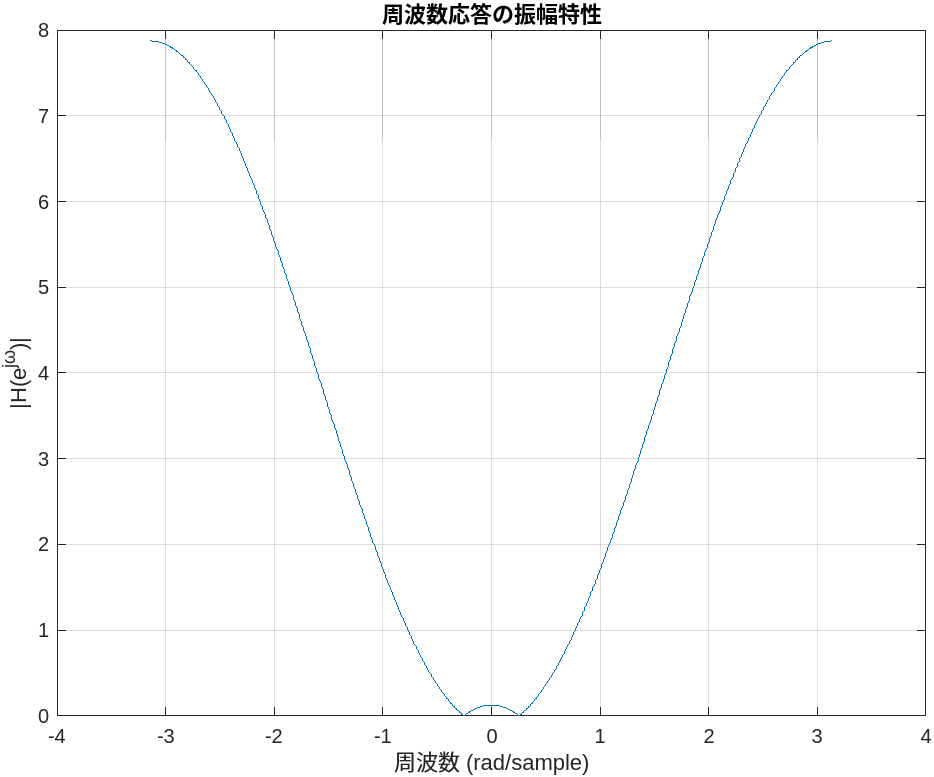
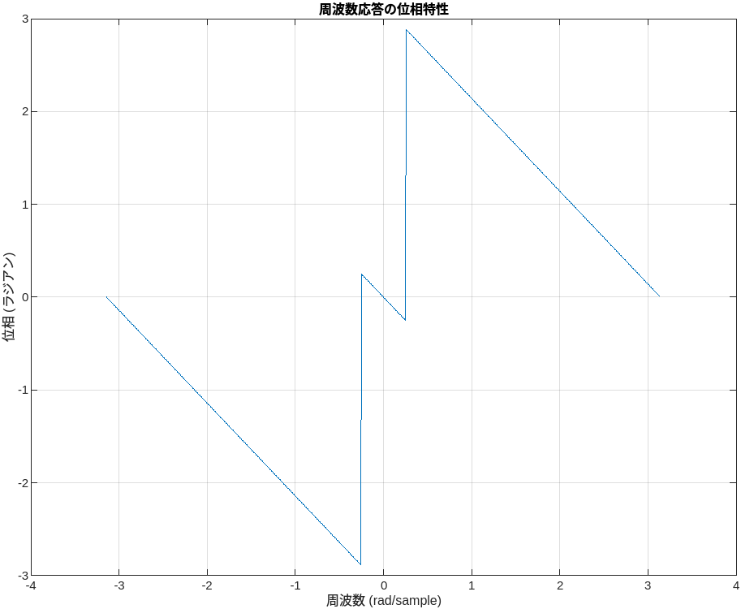
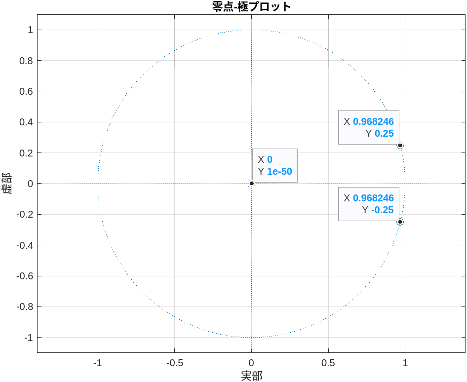

# 信号処理演習課題

2024年12月18日  
学籍番号：35714121  
名前：福富隆大  
 

  

## (a) システムの構成図 （ブロック図）を図示せよ。  

## (b) システムのインパルス応答h[n]を求めよ  

h[n]=2σ[n]-√15σ[n-1]+2σ[n-2]  

## (c) システムに以下の信号を入力した時の出力y[n]を、たたみ込みの関係式y[n]=x[n]*h[n]を用いて計算せよ。  

  x[n]={1(n=0),-1/2(n=1),0(その他)}  

y[n]={2(n=0),-1-√15(n=1),√15/2+2(n=2),-1(n=3),0(その他)}  

## (d) システムの周波数補応答H(e^jw)および振幅特性|H(e^jw)|を求めよ  

H(e^jw)=(4cos(w)-√15)e^jw  
|H(e^jw)|=|4cos(w)-√15|  

## (e )以下の信号をシステムに入力したとき、出力信号は、信号の振幅を何倍したものになるか？(d)の結果を使って答えよ。但し、位相は考えないこととする。  

  x[n]=sin(w0n),w0=pi/3  

|H(e^jw0)|=4cos(pi/3)-√15=2-√15=-1.87298...≒-1.873      よって-1.873倍  

(f) MATLAB関数freqzを用いて、システムの周波数特性をプロットせよ。また、プロットした図と(d)の結果が符合しているか確認せよ。  

振幅特性のグラフを見ると、(d)の式から計算で求められる値(y=0の時w=0.2527とw=0の時y=0.127など)と一致していることがわかった。

## (g) 上記(c)の回答が正しいことを、MATLAB関数convにより確認せよ。  

MATLAB関数のconvを使って確認すると、y=[2,-4.8730,3.9365,-1,0]と出た。  
1-√15≒4.8730,√15/2+2≒3.9365なので(c)の結果と一致している。  

## (h) 実際に音声信号をシステムに入力した時の出力信号を、MATLAB関数convあるいはfilterを用いて計算せよ。得られた出力信号を音として再生し、どのように聞こえたのかを(f)でプロットした図との関連において考察せよ。  

実際に聞いてみるとあまり違いは感じられなかったが、声が若干高くなっているように聞こえた  

## (i)システム関数(システムのインパルス応答のz変換)の極と零点をプロットし、周波数応答との関係について考察せよ。  

※プロット図だけ見ると零点と極点の区別が出来ていませんが、これは座標の表示によるものなので実際は区別されてプロットされています。  

周波数応答はH(z)=(2z^2-√15z+2)/z^2であるので、H(z)=0,H(z)=無限大となる極限を考えると、  
z=0.968246(≒√15/4)±1/4iの時にH(z)=0となり、z=0の時にH(z)=無限大となるのでプロットされている点と一致している。  
