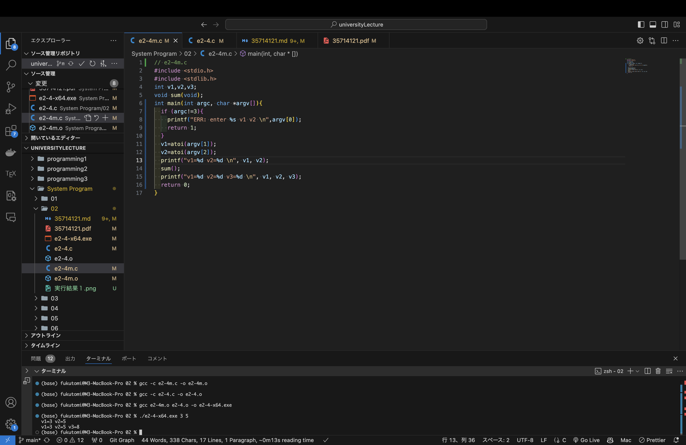
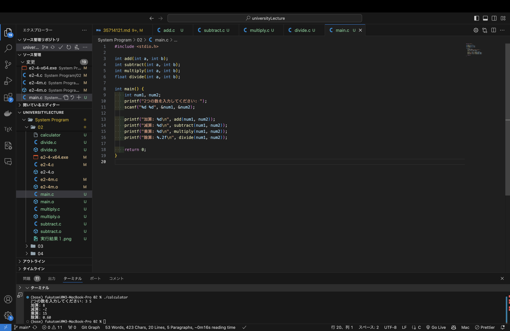

## システムプログラム第2回レポート

<div style="text-align: right;">
2024年10月8日  <br>
学籍番号：35714121  <br>
名前：福富隆大  <br>
</div>  
  
#### ① 講義資料内のe2-4m.c, e2-4.cの２つのファイルを作成して分割でコンパイルし，これらをリンクさせて実⾏ファイルを作成しなさい．  

##### 実行結果  
スライドの通りの以下の手順でコンパイルして実行した。

```bash
gcc -c e2-4m.c -o e2-4m.o  
gcc -c e2-4.c -o e2-4.o  
gcc e2-4m.o e2-4.o -o e2-4-x64.ex  
./e2-4-x64.exe 3 5  
```
結果は以下のようになった。

```bach
v1=3 v2=5 
v1=3 v2=5 v3=8 
```

画像の下の部分のターミナルに実行結果あります


##### 作成したファイル内容  
<div style="font-size: 8px;">

```c
// e2-4m.c
#include <stdio.h>
#include <stdlib.h>
int v1,v2,v3;
void sum(void);
int main(int argc, char *argv[])
{
if (argc!=3){
printf("ERR: enter %s v1 v2¥n",argv[0]);
return 1;}
v1=atoi(argv[1]);
v2=atoi(argv[2]);
printf("v1=%d v2=%d¥n",v1,v2);
sum();
printf("v1=%d v2=%d v3=%d¥n",v1,v2,v3);
return 0;
}
```
```c
//e2-4.c
extern int v1,v2,v3;
void sum(void)
{
v3=v1+v2;
}
```
</div>


#### ② 上記を基に，四則演算を⾏うプログラムを作成する．演算ごとに個別ファイルとして作成し，①と同様に実⾏ファイルを作成しなさい  

##### 実行結果  

四則演算をするコードをそれぞれファイルを分けて書いた。  
スライドの例ではexternを使っていたが、今回は関数プロトタイプ宣言を用いている。  
ファイルが多いので以下のようにまとめてコンパイルした。  
```bash
gcc -c add.c subtract.c multiply.c divide.c main.c
gcc -o calculator main.o add.o subtract.o multiply.o divide.o
./calculator
```
結果は以下のようになった(３と５はキーボード入力してます)  
```bach
2つの数を入力してください: 3 5
加算: 8
減算: -2
乗算: 15
除算: 0.60
```

画像の下の部分のターミナルに実行結果あります


##### 作成したファイル内容  
<div style="font-size: 8px;">

```c
//main.c
#include <stdio.h>

int add(int a, int b);
int subtract(int a, int b);
int multiply(int a, int b);
float divide(int a, int b);

int main() {
    int num1, num2;
    printf("2つの数を入力してください: ");
    scanf("%d %d", &num1, &num2);

    printf("加算: %d\n", add(num1, num2));
    printf("減算: %d\n", subtract(num1, num2));
    printf("乗算: %d\n", multiply(num1, num2));
    printf("除算: %.2f\n", divide(num1, num2));

    return 0;
}
```
```c
//add.c
#include <stdio.h>
int add(int a, int b) {
    return a + b;
}
```
```c
//subtract.c
#include <stdio.h>
int subtract(int a, int b) {
    return a - b;
}
```
```c
//multiply.c
#include <stdio.h>
int multiply(int a, int b) {
    return a * b;
}
```
```c
//divide.c
#include <stdio.h>
float divide(int a, int b) {
    if (b != 0) {
        return (float)a / b;
    } else {
        printf("エラー: 0で割ることはできません。\n");
        return 0;
    }
}
```
</div>

#### 講義に対する感想・質問・意⾒

今までは⾼⽔準言語のプログラミング言語と低水準言語のアセンブリ言語を別々に勉強してきたので、この講義で二つを結びつけて勉強していきたいです。  
また、アセンブリコードについてもより詳しく理解していきたいです。