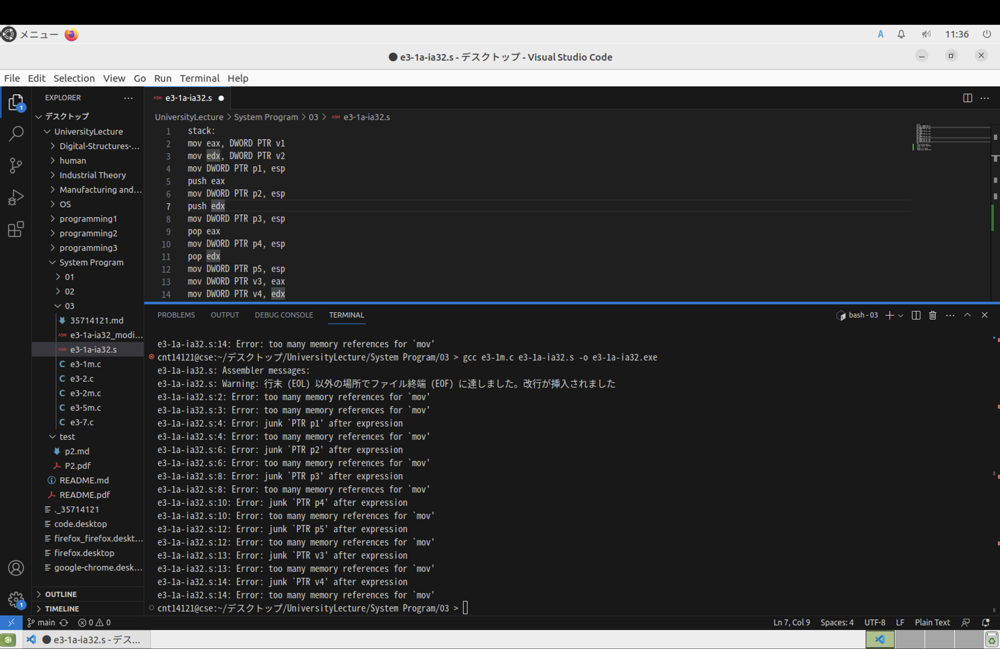
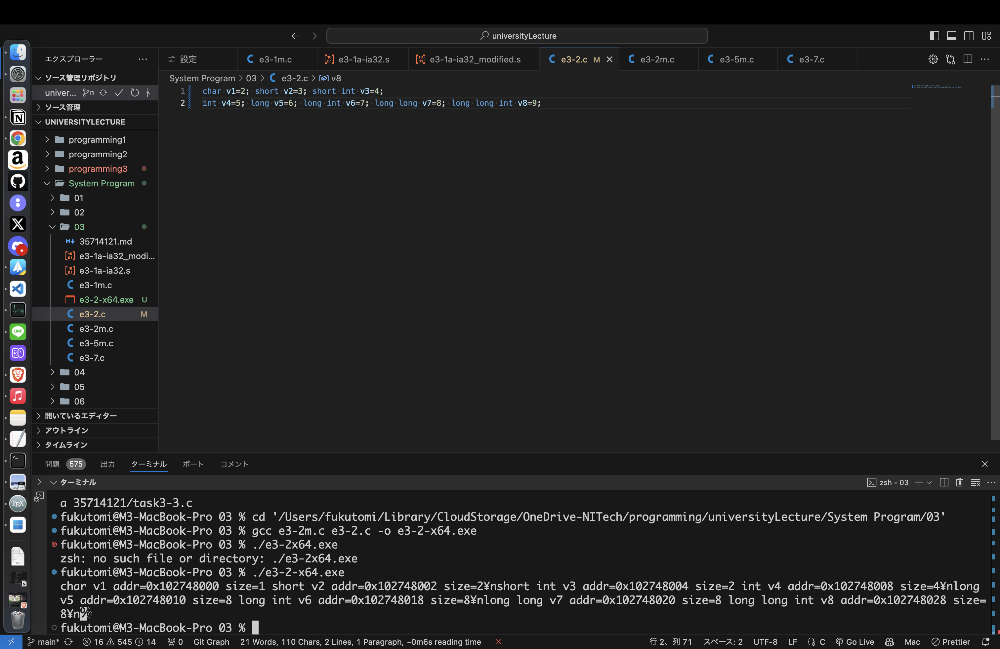

## システムプログラム第3回レポート

2024年10月15日   
学籍番号：35714121   
名前：福富隆大   

  
  
#### ① 講義資料内のe3-1m.c, e3-1a-ia32.s ２つのファイルを作成してコンパイルし，実⾏ファイルを作成して，これを実⾏しその結果を報告してく ださい．

##### 実行結果  

画像の下の部分のターミナルに実行結果あります

##### 作成したファイル内容  

#### ② e3-1a-ia32.sを修正して，popした値をedx, eaxの順に格納するようにして，①と同様に実⾏ファイルを作成してこれを実⾏し，その結果を報 告してください．  

##### 実行結果  

画像の下の部分のターミナルに実行結果あります

##### 作成したファイル内容  

#### ③ e3-2.cの変数に⼊れる値を変更したものとe3-2m.cのファイルを作成してコンパイルし，実⾏ファイルを実⾏した結果を報告してください．  

##### 実行結果  

画像の下の部分のターミナルに実行結果あります

##### 作成したファイル内容  

#### ④ e3-5m.cとe3-7.cの２つのファイルを作成してコンパイルし，実⾏ファ イルを実⾏した結果を報告してください．  

##### 実行結果  

画像の下の部分のターミナルに実行結果あります

##### 作成したファイル内容  

#### 講義に対する感想・質問・意⾒

