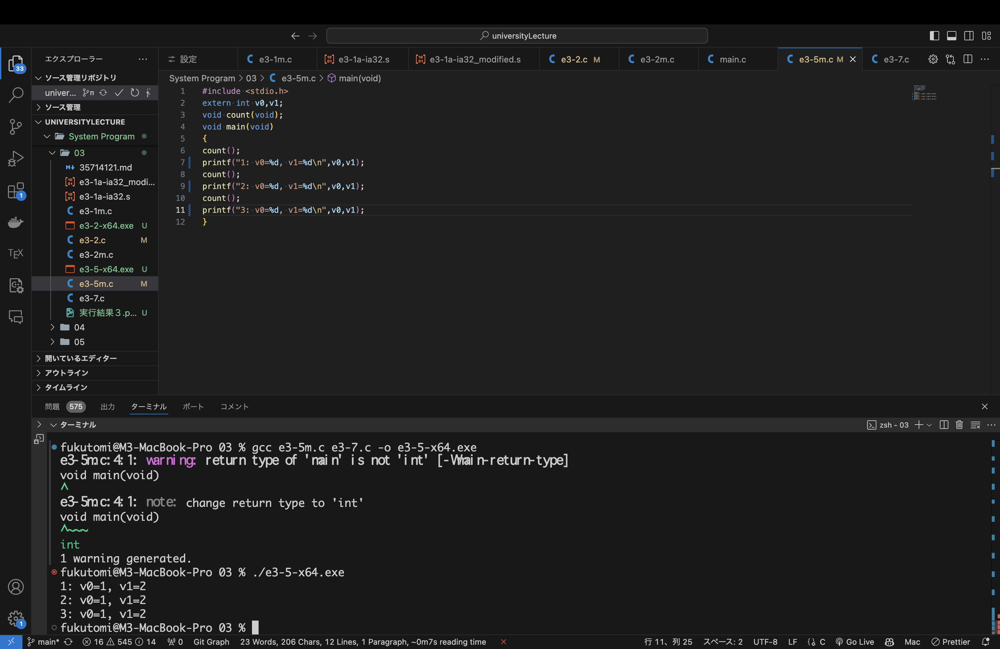

## システムプログラム第3回レポート

2024年10月18日   
学籍番号：35714121   
名前：福富隆大   

  
  
#### ① 講義資料内のe3-1m.c, e3-1a-ia32.s ２つのファイルを作成してコンパイルし，実⾏ファイルを作成して，これを実⾏しその結果を報告してく ださい．

##### 実行結果  

エラーのためなし

##### 作成したファイル内容、結果について  
作成したファイルをコンパイルするとエラーとなった。  
原因を調べるためにエラーを調べてみると書き方が合っていないようだった。  
cseでarchコマンドを用いてアーキテクチャを確認してみるとx86_64と表示されIA32とは違うことがわかった。 
よって、このファイルがエラーとなった原因はアーキテクチャによって命令形式と動作が違うからである。  

#### ② e3-1a-ia32.sを修正して，popした値をedx, eaxの順に格納するようにして，①と同様に実⾏ファイルを作成してこれを実⾏し，その結果を報 告してください．  

##### 実行結果  

エラーのためなし

##### 作成したファイル内容、結果について  
①と同じ理由の理由でエラーになった。 
popした値をedx, eaxの順に格納するには、もともとpop edx,pop eaxの順に実行しているので、それをpop edx,pop eaxのように順番を変えれよい。 
こうすることでpopした値を格納する順番がedx→eaxとなる。    

#### ③ e3-2.cの変数に⼊れる値を変更したものとe3-2m.cのファイルを作成してコンパイルし，実⾏ファイルを実⾏した結果を報告してください．  

##### 実行結果  

画像の下の部分のターミナルに実行結果あります

##### 作成したファイル内容について  
このコードはprintfを使用して、各変数のアドレスとサイズを出力している。  
&演算子を用いて変数のアドレスを取得し、sizeof演算子で変数のサイズを取得している。 
データ型によってサイズが違うので適切に使用することでメモリ使用量やパフォーマンスを向上させることができる。  

#### ④ e3-5m.cとe3-7.cの２つのファイルを作成してコンパイルし，実⾏ファ イルを実⾏した結果を報告してください．  

##### 実行結果  

画像の下の部分のターミナルに実行結果あります

##### 作成したファイル内容、結果について  
e3-7.cでは⾃動変数でcを定義しているので毎回変数が消滅してしまいカウントできていない。 
これを防ぐためには、自動変数ではなく⼤域変数を使うか、自動変数でもカウントできるようにプログラムを作る必要がある。  

#### 講義に対する感想・質問・意⾒
様々な変数の型があり、それぞれの特性がかなり違うので、変数を宣言する時はどの型で宣言するのが適切かをしっかり考えるべきだと感じた。  
また、様々な型が持つ特性について、なぜそのような特性を持つかを理解することでバグの原因を突き止め安くなると思う。  