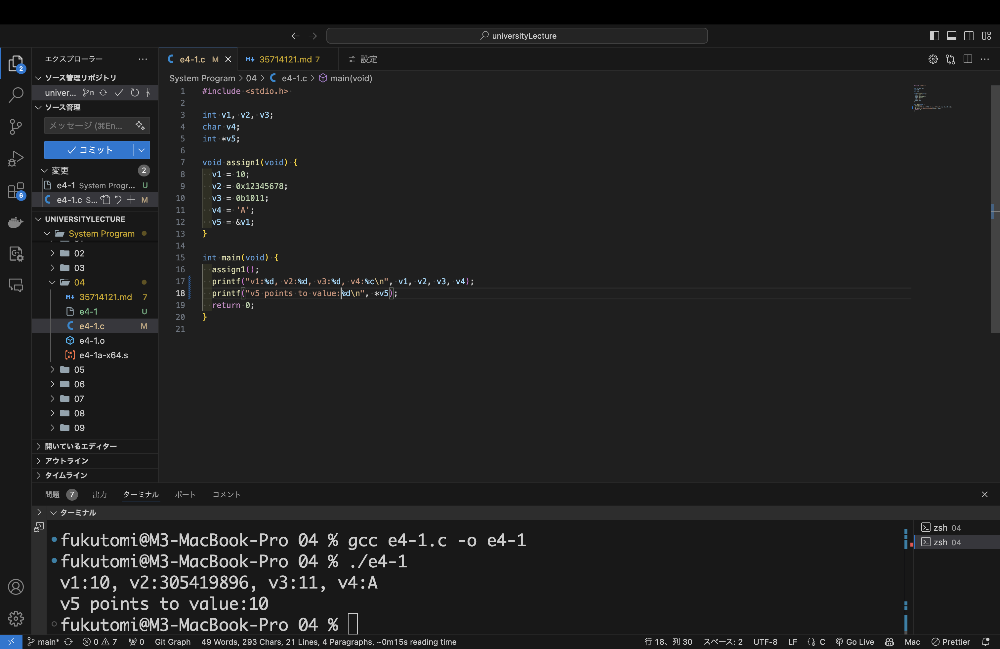
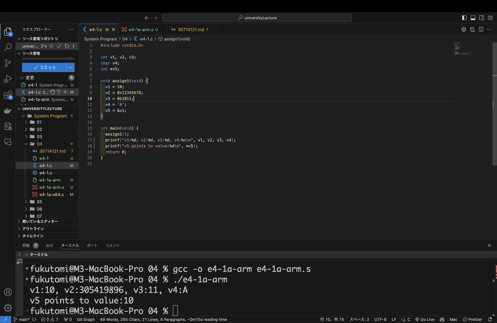

## システムプログラム第4回レポート

2024年10月22日   
学籍番号：35714121   
名前：福富隆大   

  

#### 4-23ページのe4-1.cと4-24ページのe4-1a-x64.sを実⾏ファイルにコンパイルし，実⾏してください  

##### 実行結果  

画像の下の部分のターミナルに実行結果あります

##### 作成したファイル内容、結果について  
スライドにあったコードは値を代入するところまでだったので、main関数でターミナルに表示させた。  
V5はポインタなのでV5のポインタが指す値を表示させた。  

##### 実行結果  

画像の下の部分のターミナルに実行結果あります

##### 作成したファイル内容、結果について  
C言語でした動作と同じ動作になるようにアセンブラを書いた。  
出力もV1~V4は入っている値をV5はポインタの示す場所の値を表示させた。  

#### 講義に対する感想・質問・意⾒
アーキテクチャ毎に命令や動作が少し違うので、アーキテクチャ毎に分けてプログラムを作っていた時は大変だと感じた。  
今は幸いハードの制約が緩くなっているので、バグの起こりにくい読みやすいコードの方が優先されるのでありがたい。  
しかし、アーキテクチャが原因のバグが出たり、Iotなどのハード的リソースの限られたシステムを作るときなどのためと、教養のためにしっかりアーキテクチャレベルで学んでいきたい。 