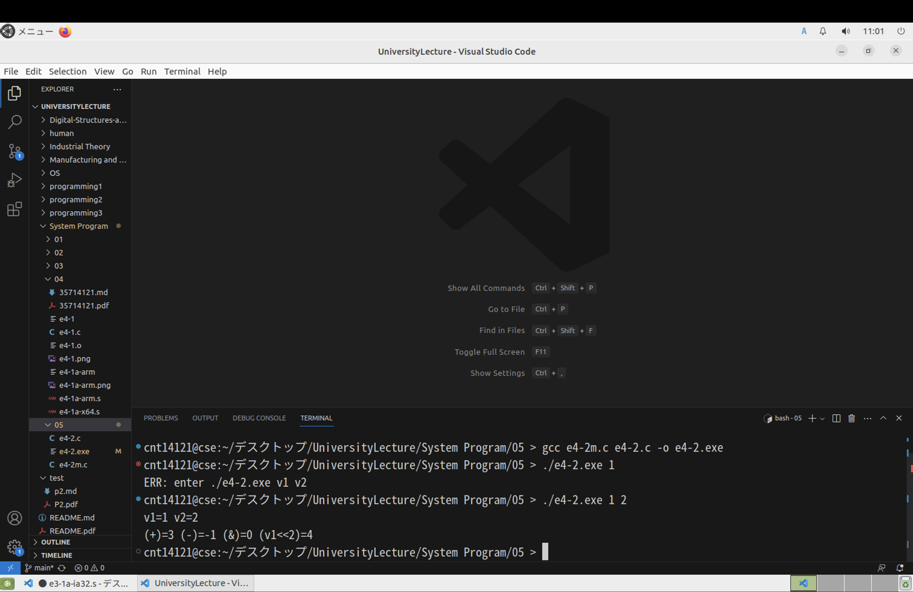

## システムプログラム第4回レポート

2024年10月29日   
学籍番号：35714121   
名前：福富隆大   

  

#### 1. 4-31ページの e4-2m.c と e4-2.c の２つのファイルを作成してください
#### 2. CSE上で，“gcc e4-2m.c e4-2.c -o e4-2.exe”を実⾏し， 実⾏ファイル e4-2.exeを作成してください．
#### 3. e4-2.exeファイルを実⾏し，問題なく動作することを確認 してください

##### 実行結果  

画像の下の部分のターミナルに実行結果あります

##### 作成したファイル内容、結果について  
加算、減算は想像どうりの結果になった。AND命令は１が０００１、２が００１０なので結果が００００となり、０と表示されている。  
シフト演算は１（０００１）の２ビットシフトなので０１００となり４と表示されている。  

#### 4. CSE上で，”objdump –d e4-2.exe”を実⾏し，実⾏ファイ ルの逆アセンブルを⾏い，関数assign2に該当する所のアセンブリコードを説明し，これをレポートとして提出してください

##### 実行結果（一部抜粋）  

000000000000123b <assign2>:
    123b:       f3 0f 1e fa             endbr64  
    123f:       55                      push   %rbp  
    1240:       48 89 e5                mov    %rsp,%rbp  
    1243:       8b 15 cb 2d 00 00       mov    0x2dcb(%rip),%edx        # 4014 <v1>  
    1249:       8b 05 c9 2d 00 00       mov    0x2dc9(%rip),%eax        # 4018 <v2>  
    124f:       01 d0                   add    %edx,%eax  
    1251:       89 05 c5 2d 00 00       mov    %eax,0x2dc5(%rip)        # 401c <v3>  
    1257:       8b 15 b7 2d 00 00       mov    0x2db7(%rip),%edx        # 4014 <v1>  
    125d:       8b 05 b5 2d 00 00       mov    0x2db5(%rip),%eax        # 4018 <v2>  
    1263:       29 c2                   sub    %eax,%edx  
    1265:       89 15 b5 2d 00 00       mov    %edx,0x2db5(%rip)        # 4020 <v4>  
    126b:       8b 15 a3 2d 00 00       mov    0x2da3(%rip),%edx        # 4014 <v1>  
    1271:       8b 05 a1 2d 00 00       mov    0x2da1(%rip),%eax        # 4018 <v2>  
    1277:       21 d0                   and    %edx,%eax  
    1279:       89 05 a5 2d 00 00       mov    %eax,0x2da5(%rip)        # 4024 <v5>  
    127f:       8b 05 8f 2d 00 00       mov    0x2d8f(%rip),%eax        # 4014 <v1>  
    1285:       c1 e0 02                shl    $0x2,%eax  
    1288:       89 05 9a 2d 00 00       mov    %eax,0x2d9a(%rip)        # 4028 <v6>  
    128e:       90                      nop  
    128f:       5d                      pop    %rbp  
    1290:       c3                      ret      

##### 作成したファイル内容、結果について  
ベースポインタをスタックにプッシュし、スタックポインタの値をベースポインタに移動させている  
そのあとはmovでV1などの演算に必要な値をレジスタに読み込み、その後に演算命令をしている  
そのあとにnopの何もしない命令をしている  
スタックからベースポインタをポップし、元のスタックフレームに戻っている。  
最後にリターンしている。  

#### 講義に対する感想・質問・意⾒  
少しずつアセンブラに慣れてきた。  
armは符号長が同じなのでとても見やすくてありがたい。  
今回の課題でアセンブラを見た時に、nopという何もしない命令が入っていたが、なぜ入っているかわからなかった。  