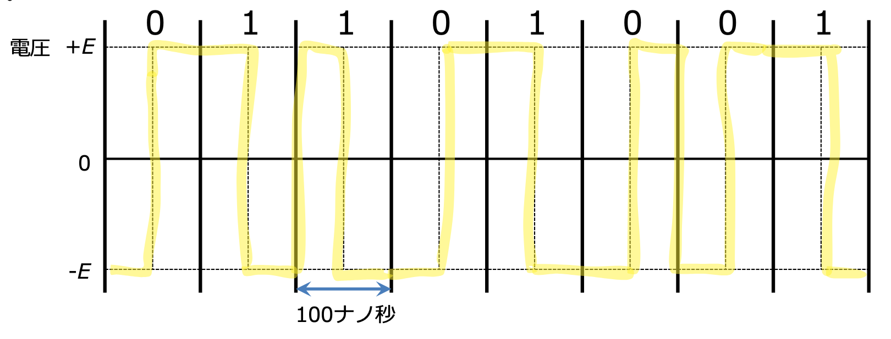

## タイトル

2025年5月20日  
学籍番号：35714121  
名前：福富隆大  
 
 

  

# 情報ネットワーク第5回レポート

## 総遅延量

単位はbit  
パケット数 u/d  
１パケットのデータ　8d＋8h  
1秒あたりに送れるデータ　B  
１パケットを送るのにかかる時間 8d+8h/B  
ルーター１個あたりの遅延　8d+8h/B  
ルーターによる遅延　(8d+8h/B)r  
伝搬遅延　0.01秒  
総遅延量　0.01+((8d+8h)/B)r+((8d+8h)*(u/d))/B  

## 2. 表

| ⽅式 | 信号に関わらずビット同期が可能 | 信号に関わらず平均電圧 |
| --- | --- | --- |
| 単流NRZ | x | x |
| 単流RZ | x | x |
| 複流NRZ | x | x |
| 複流RZ | o | x |
| バイポーラ | x | o |
| マンチェスター | o | o |

## 3. 図

