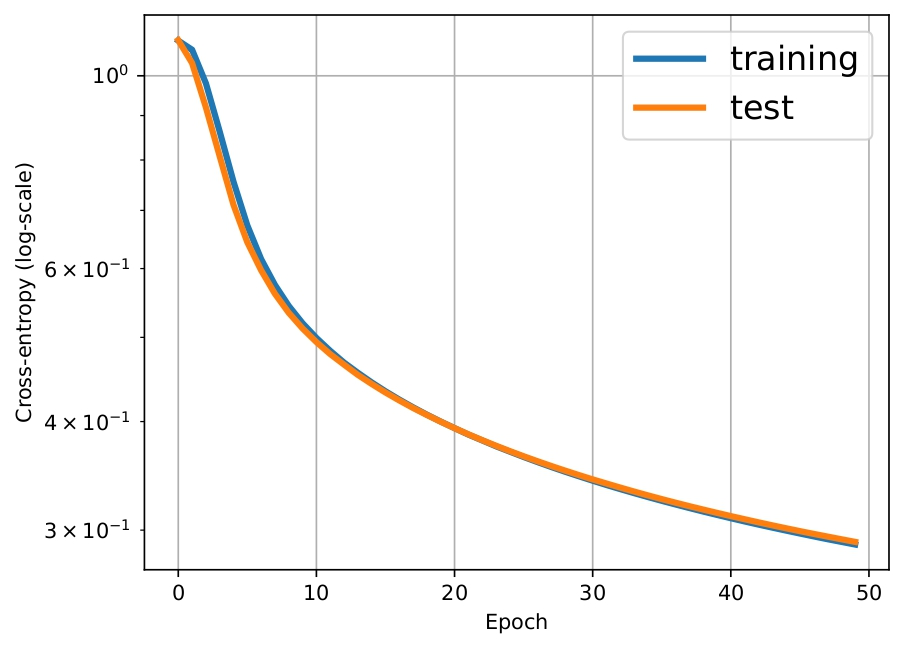
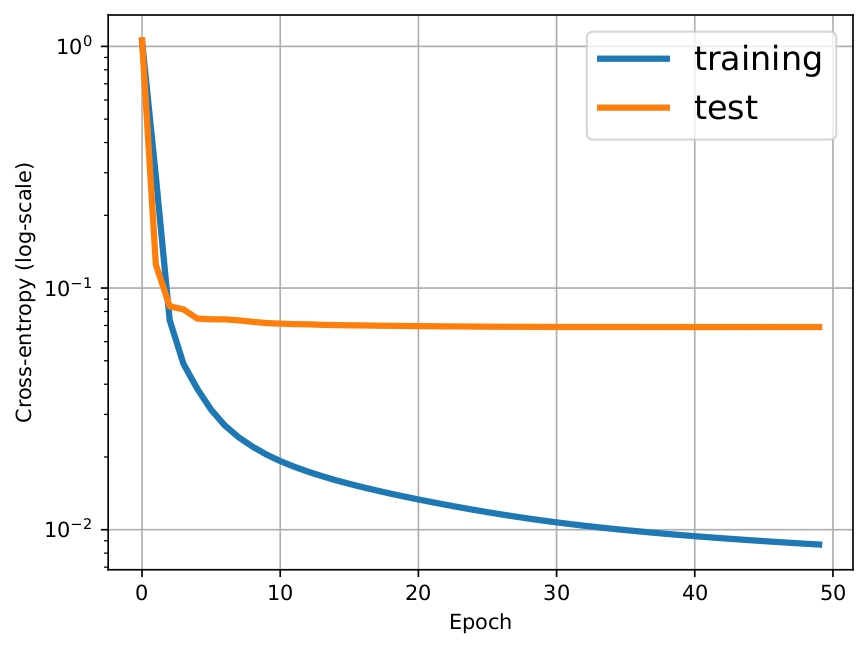
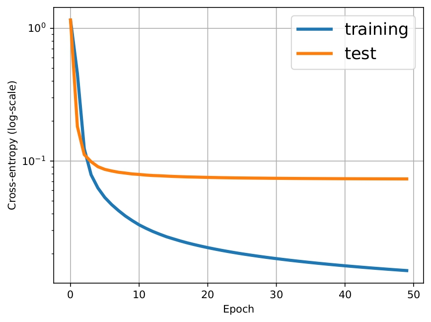
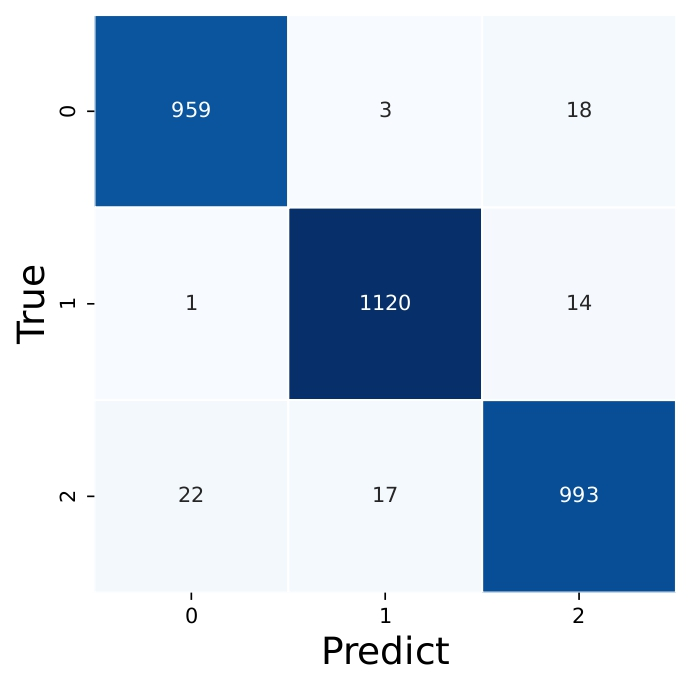
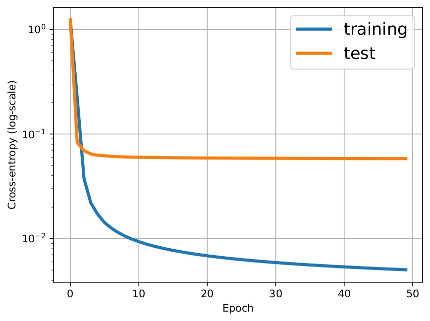
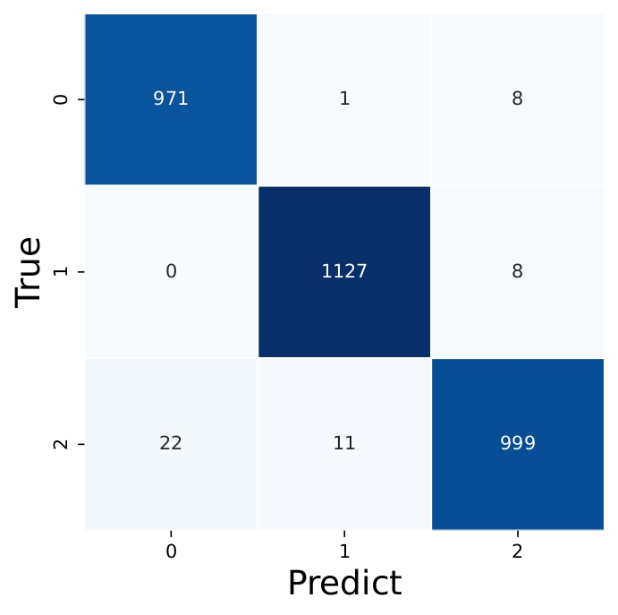

# 知能プログラミング演習I 第2回レポート

**学籍番号**: 35714121  
**氏名**: 福富隆大  
**日付**: 2024年9月18日

## 1. 実験設定

本実験では、MNISTデータセットの手書き数字（0〜2）を分類する深層ニューラルネットワークを実装した。ネットワークの基本構成は以下の通りである：

- 入力層：784ユニット（28×28ピクセルの画像）
- 第1中間層：100ユニット、活性化関数はReLU
- 第2中間層：50ユニット、活性化関数はReLU
- 第3中間層：10ユニット、活性化関数はReLU
- 出力層：3ユニット（クラス数）、活性化関数はソフトマックス

学習率は$\eta = 10^{-2}/\text{epoch}$とし、エポック数は50とした。訓練データとテストデータはMNISTデータセットから、クラス0, 1, 2のみを抽出して使用した。

また、以下の実験を行った：
1. 基本設定での学習と評価
2. 活性化関数の比較実験：ReLU、シグモイド関数、ハイパボリックタンジェントを使用した場合の比較
3. 中間層のユニット数を変更した実験：(50-25-5)と(200-100-20)の2種類の構成で比較

## 2. 結果

### 2.1 基本設定での学習結果

図1に訓練誤差とテスト誤差の推移を示す。エポックが進むにつれて誤差が減少し、約20エポック後に収束している。最終的なテスト誤差は約0.1であった。

図2に混同行列を示す。対角成分が大きく、非対角成分が小さいことから、高い分類精度が得られていることがわかる。特に、クラス0とクラス1の分類精度が高く、クラス2の分類精度がやや低い傾向が見られた。

### 2.2 活性化関数の比較

図3と図4に、シグモイド関数を用いた場合の誤差推移と混同行列を示す。ReLUと比較して、シグモイド関数は学習の初期段階では誤差の減少が遅いが、最終的には収束している。

図5と図6に、ハイパボリックタンジェント（tanh）を用いた場合の誤差推移と混同行列を示す。tanhはReLUとシグモイド関数の中間的な挙動を示し、比較的良好な結果が得られた。

### 2.3 中間層のユニット数の比較

図7と図8に、中間層のユニット数を減らした場合（50-25-5）の誤差推移と混同行列を示す。基本設定(100-50-10)と比較して、学習が速く収束するが、最終的な誤差はやや大きくなった。

図9と図10に、中間層のユニット数を増やした場合（200-100-20）の誤差推移と混同行列を示す。学習は遅いが、最終的な誤差は小さくなり、より高い分類精度が得られた。

## 3. 考察

### 3.1 活性化関数の影響

ReLUは勾配消失問題が起きにくく、計算も単純なため、学習が効率的に進んだと考えられる。図3と図5から、シグモイド関数とtanhは学習の初期段階では誤差の減少が遅いことがわかる。これは、これらの関数が飽和領域を持ち、勾配が小さくなりやすいためである。

シグモイド関数は出力が0から1の間に制限されるため、深い層では勾配消失問題が発生しやすく、学習が遅くなったと考えられる。一方、tanhは出力が-1から1の間に制限されるため、シグモイド関数よりも勾配消失問題が緩和され、中間的な性能を示したと考えられる。

混同行列（図4、図6）を見ると、活性化関数によって誤分類のパターンが若干異なることがわかる。これは、各活性化関数が特徴空間を異なる方法で変換するためと考えられる。

### 3.2 ネットワーク構造の影響

中間層のユニット数を増やすと表現力が向上するが、過学習のリスクも高まる。図7と図9から、ユニット数を減らした場合は学習が速く収束するが、最終的な誤差はやや大きくなることがわかる。一方、ユニット数を増やした場合は学習が遅いが、最終的な誤差は小さくなる。

本実験では、基本設定（100-50-10）が最もバランスが良く、高い分類精度を示した。ユニット数を減らした場合(50-25-5)は、モデルの表現力が不足し、複雑なパターンを学習できなかった可能性がある。これは図8の混同行列からも確認できる。一方、ユニット数を増やした場合(200-100-20)は、表現力は向上するが、学習に時間がかかり、過学習のリスクも高まる。しかし、図10の混同行列を見ると、分類精度は向上していることがわかる。

### 3.3 誤分類の分析

すべての混同行列から、クラス2（数字の「2」）の分類精度がやや低いことがわかる。これは、「2」の形状が複雑で、書き方のバリエーションが多いためと考えられる。特に、「2」と「1」の混同が見られたが、これは「2」の上部が「1」に似ている場合があるためと推測される。

また、ユニット数を増やした場合（図10）では、この問題が緩和されていることから、より複雑なパターンを学習するためには十分な表現力が必要であることがわかる。

### 3.4 総括

深層ニューラルネットワークはMNISTデータセットの分類に高い精度を示した。特にReLUを活性化関数として用いた場合に良好な結果が得られた。また、ネットワークの構造（層の数やユニット数）も性能に大きく影響することがわかった。

活性化関数の選択とネットワーク構造の設計は、タスクの複雑さやデータの性質に応じて適切に行う必要がある。本実験の結果から、MNISTのような比較的単純なタスクでは、ReLUを活性化関数とし、適度なユニット数（100-50-10）を持つネットワークが効率的であることがわかった。

今後の課題としては、より複雑なデータセットでの評価や、正則化手法の導入による過学習の抑制、さらには異なるネットワークアーキテクチャ（CNN、RNNなど）の比較などが考えられる。