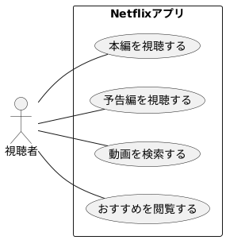
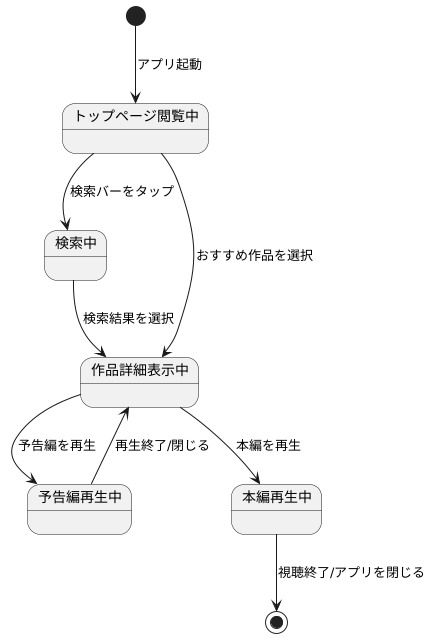
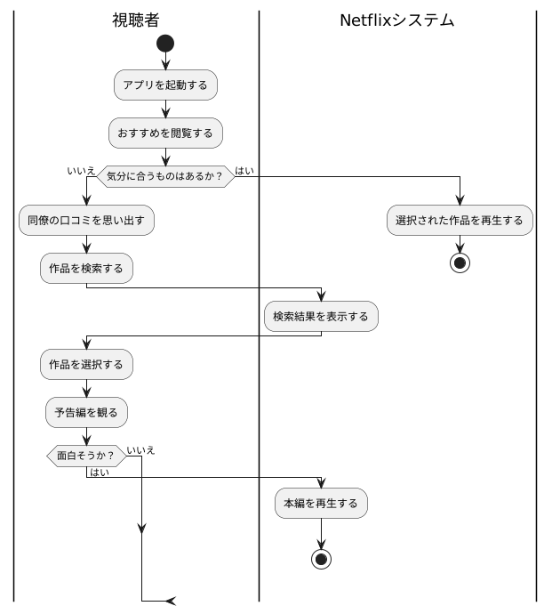
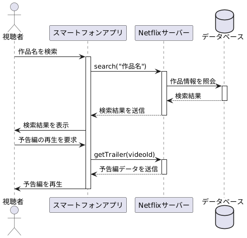
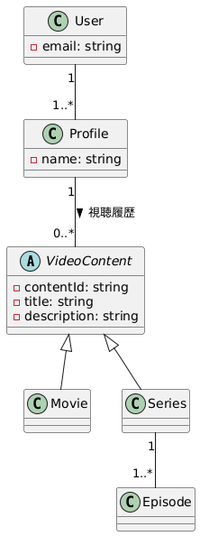
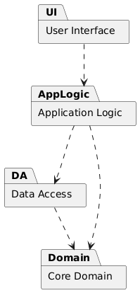
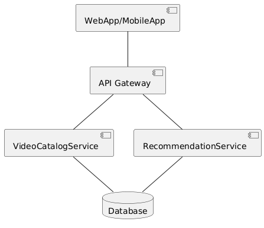

# ソフトウェア工学 レポート課題5~6(中間)

2025年6月19日授業分   
学籍番号：35714121   
名前：福富隆大   
 

## システムとシナリオの設定

### システムとシナリオの要約

#### システム概要
* **システム名:** Netflix (ネットフリックス)
* **概要:** 月額定額制の動画配信サービス。多様なデバイスで映画やドラマを広告なしで視聴でき、ユーザーの視聴履歴に基づく作品推薦を特徴とする。

---

#### ペルソナ
* **ペルソナ1：鈴木 美咲（28歳・独身会社員）** 都心で一人暮らし。流行に敏感で、SNSで話題の作品を平日の夜に観てリラックスするのが習慣。観たい作品が多すぎて、選ぶのに疲れることがある（選択疲れ）。

* **ペルソナ2：佐藤 健一（45歳・既婚会社員）** 妻と小学生の子供2人と郊外に住む。週末に家族全員でリビングで視聴することが多い。世代の違う家族全員が楽しめる作品を探すのに苦労している。

---

#### シナリオ：「仕事終わりのご褒美探し」
平日の夜、仕事から帰宅した美咲（ペルソナ1）は、リラックスできる面白い動画を求めてNetflixを開きます。トップ画面のおすすめ作品を眺めますが、その時の気分に合うものが見つかりません。ふと、同僚が勧めていたコメディドラマを思い出し、検索して発見。予告編を観て面白そうだと感じ、第1話の再生を始めます。

---

#### シナリオ選択の着眼点
このシナリオは、「疲れているので気軽に楽しみたい」という多くのユーザーに共通する利用動機と、「何を観るか決まっていない」状態から、最終的に視聴コンテンツを決定するまでの一連の行動を描いています。特に、アプリ内の推薦機能だけでなく、外部の口コミ（同僚の勧め）が視聴のきっかけとなる現実的なコンテンツ発見プロセスに着目しました。

## ユースケース図(以下では図がリンクになっています)

誰が（アクター）、システムで何ができるか（ユースケース）を俯瞰するための図です。このシナリオに関わる視聴者の基本的な操作を表現しています。

## ステートマシン図

[](https://editor.plantuml.com/uml/PP9DInjH68NtyoikRWH1kWz4fFG727LNkXZie4AgC8cKxdBlrH0JlshRKTiGCHsYfhQAIPenHFqn9_EHbN-XxvtFIZS3C-TvpptlcJjVBEbcQUDzGPjc-NoUGTn1LY17a5N89iG0ikj-xogHaA1pvHtlvTZOAOFRuByXEf0MX0Dn3d5DKq-ZQj2s0juBobjFesrY_DeVRwiEleCoXx0XJyXJ-VEV4FJy0Tu6lmpTwBL2trrxszsnm8z2QHDy7xmESHYSNVZx3-0d47MKXQPH_9B1fiAq4l88yfiABvo9THkqpyVEhocc5zbBS_r3qKXepsxulLQYlJPqSsbbTMqvaSVt3VSp3owxVkz67MWF4_ILKT9N2yKK75RTJpL_SE5MTlqlfmcrQ19acEbfZQl_a8M2_b6TgBsPUSjcP-VYW2n7Fw0Lhj49-WEt_bMB1SMaGGcBLe0y2BSzX7YCzjSoI8t4WTC1lt_WDHiqCE6ELsl-wvwXu3NLi2gPHrra0rg2gP5uKHf9co0osbHBnEVUaUZtnNXOUJ6nw7eSqwzyRXkNeqA7rMMUYQ8erLoEHLSjzakxKtapxtbZxHtTyBy0)

一つのオブジェクトの状態が、特定の出来事（イベント）によってどのように変化していくか（遷移するか）を示す図です。視聴者のアプリ内での状態変化を表現しています。

## アクティビティ図

[](https://editor.plantuml.com/uml/VLBBJi9G4DttA-vENFW368nVu3-O29447v6Qk631t2eWzL55yGMYO8fH0WOaA55_PhXjMVaBpb2hX4IJ9ftREJFdqJkVr1StzCsLX3Ob8f68G5b5sK8ZWxA6Hi4lr5M7cmJn7XhE-K5OE8NzmNi9eJaicgfk8fWeTzsk7FGp21y8TMgfhErQT6mwNK2vX_8Oqw1o6TMsg5RM8qf0iBtRU_UGHYvGcfYMcfRoxA87prvw9wMDr6bXLcMSeV50WrwtfynJ7pzBBSXppKTYEHuMsvvT3xhnc0WvJsT4Yl2eh1m2sP4a2Q6589aHpC-tohJGbwEh8eImFNfoqveGOMNjAUEIdHpMK7RGg121aouJH6Nxn37BACf15PZQkIkvpzM0MeZKGbIF9U9RA7ieNpb9uoR54pxGxLhETOaDKG1t_R6vCV_Z-uVmukIlVt7XGJ-dZl9kxvwNs9tlp-nvMAww5-y8PJOyuP2CRxEzlmMon5B3twio--v9vPTKYAI-jav5D96CJWGsALs8cJdnx_-XDQjByPWMB0kq_HbTaC4fNoYe_6GpANCaqjyzJo-wtry0)

ある操作の開始から終了までの処理の流れを示す図です。シナリオにおける、美咲さんが動画を見つけるまでの具体的な行動フローを、判断の分岐を含めて表現しています。

## シーケンス図

[](https://editor.plantuml.com/uml/ZPFBJi9058RtVOe96tNX2v1WaB1nuqPzW96EsWI5j9Muf6T42KR56ueI5MD4YT4GDDvG7-RGYs_XJ06f6XCNlMJw___vpZbfr32fRYxE9vK14eb42C83yXP20taJuSa-QifZyT6hNpi76s4Xg2Cl8JmYr11kaUS_IZjetI2l8kS8BxxzKPx0CaB1tXJY0iAsKmQt-MBdzz6gUTLBT_CDhJB26cP1KMZ2JEd4koXvrfsNpH5ga2c3wKfQm6a9BKqNJ18IFCYFPJxF8zz3kF8Xpv3l8w-7f6aqdVxk6MVcJ59RGhZtVKLnzuKJJC-8V9MQT9eQJ8JpLP_y7NdPVtdoTV6OeaWICZmYmyEa_LgnTooxk2vREg-uTsSINijGa_dLnIMrdVmmCHZL4tE3eIzRQAYlxq9q7j8LZ_KAE3nddpP43JTNQxSE-nu158-HuK293eLxNtIEAuhAWifUSWy-A1NP7rch_LuDUhf4tIPauxzCSdVdpp-dyfotjmhkmwNOkxsoxkwUIEM5vJJWvqHccJcfKot9zC6CfhBKcFhtH7x7Vstfl_HzAsnto88EkJ4boXPKyGTy0W00)

オブジェクト間のメッセージのやり取りを時系列で示す図です。美咲さんが検索を行い、予告編を再生するまでの、スマートフォンアプリとサーバー間の通信の流れを表現しています。

## クラス図

システムを構成するクラス（データの構造や振る舞いを定義したもの）と、それらの静的な関係性を示す図です。Netflixの動画配信サービスを構成する基本的な要素（ユーザー、プロフィール、動画コンテンツなど）の構造を表現しています。

## パッケージ図

関連するクラスなどをグループ化したパッケージ間の依存関係を示す図です。システムのアーキテクチャを大まかな機能の塊（UI、ロジック、データ層など）で表現しています。

## コンポーネント図

システムを構成する物理的な部品（コンポーネント）と、それらの依存関係を示す図です。Netflixのシステムが、どのようなサービスコンポーネント（動画カタログ、推薦サービスなど）の連携によって成り立っているかを表現しています。

はい、承知いたしました。これまでのやり取りを踏まえ、課題の続きを記述します。

---

## どの生成AIを，どの課題もしくはタスクに，どのように利用したか

Googleの生成AIである**Gemini**を利用した。

利用したタスクは、以下の通りである。
1.  **システムとシナリオの策定:**
    * 身近なシステムとして「Netflix」を選定し、その概要、主要なペルソナ2名（20代独身女性、40代既婚男性）、および典型的な利用シナリオ（ペルソナ1が平日の夜に動画を探して視聴する）の草案を作成してもらった。
2.  **各種UML図のPlantUMLコード生成:**
    * 上記で策定したシナリオに基づき、7種類のUML図（ユースケース図、ステートマシン図、アクティビティ図、シーケンス図、クラス図、パッケージ図、コンポーネント図）のコードを、Web上でUMLをレンダリングできるツール「PlantUML」の形式で生成させた。
3.  **成果物の整形と要約:**
    * 初回のシナリオ説明が長文だったため要約を指示したり、最終的な提出形式を想定してマークダウン形式への整形を指示したりした。

4.  **レポートの推敲:**
    * 作成したレポートに対し、見やすく整形してもらった。

これらのタスクは、単一の対話（チャットセッション）内で、Geminiに対して段階的に指示を与える形で進めた。

## 生成AIを利用してうまくできた点・助かった点，思ったよりうまくいかず困った点

### うまくいった点・助かった点

* **思考の高速な具体化:** ゼロからペルソナやシナリオを考える手間が省け、AIが生成した具体的で典型的な草案を元に思考を開始できた。これにより、課題の初期段階にかかる時間を大幅に短縮できた。
* **作図作業の効率化:** 7種類ものUML図の構文を正確に記述する作業は非常に時間がかかるが、シナリオを理解した上で適切なPlantUMLコードを瞬時に生成してくれたため、作図の負担が劇的に軽減された。複雑な図の骨子を即座に得られた点は、特に助かった。
* **一貫性の担保:** 一連の対話を通じて、最初に設定したシナリオとペルソナという文脈（コンテキスト）が一貫して維持された。そのため、各UML図の間で設定のブレや矛盾が生じることなく、整合性の取れた成果物を効率的に作成できた。

### 思ったよりうまくいかず困った点

* **出力の冗長性:** 初回のシナリオ説明が、レポートに記述するには詳細すぎる内容で出力された。そのため、「短くして」という追加の指示を与えて、意図する粒度に調整する必要があった。
* **UMLの抽象度:** 生成されたUML図はシナリオを反映した一般的なモデルであり、特定の設計意図を細かく反映したものではなかった。例えば、クラス図の具体的な属性や操作、シーケンス図のより詳細なメッセージのやり取りなど、深いレベルの設計については、AIがシナリオから読み取れる情報に限界があった。

## 人間の介在（自身の判断・修正・補正）がどの程度必要だったか

生成AIは強力なアシスタントであったが、質の高い成果物を得るためには、人間の介在が複数の段階で不可欠だった。

1.  **課題の定義と方向付け:**
    * どのシステムを題材にするか、どのようなペルソナやシナリオを想定するか、そして最終的にどのような成果物（UML図）を作成するかという、課題全体の枠組みとゴール設定は人間が行った。

2.  **生成物に対する評価とフィードバック:**
    * AIの出力が冗長であれば要約を指示し、形式が不適切であれば整形を指示するなど、生成された内容を評価し、より適切な形になるようフィードバックを与える役割を担った。これは、AIを望むゴールに導くための「舵取り」に相当する。

3.  **専門的観点からのレビューと修正:**
    * AIが生成したUML図のコードは「下書き」と位置づけられる。その内容が、システム設計の観点から妥当であるか（例：クラス間の関係は適切か、アクティビティのフローに無理はないか）を専門的な知識に基づいてレビューし、必要に応じてコードに直接修正を加える作業は、人間が行う必要があった。

結論として、AIは思考の壁打ち相手や定型作業の自動化ツールとして非常に有用だったが、**課題の目的を達成するための最終的な品質担保と意思決定は、全面的に人間の判断に依存していた。** AIが8割のドラフトを作成し、人間が残りの2割のレビュー、修正、仕上げを行った、という程度の介在が必要であった。
