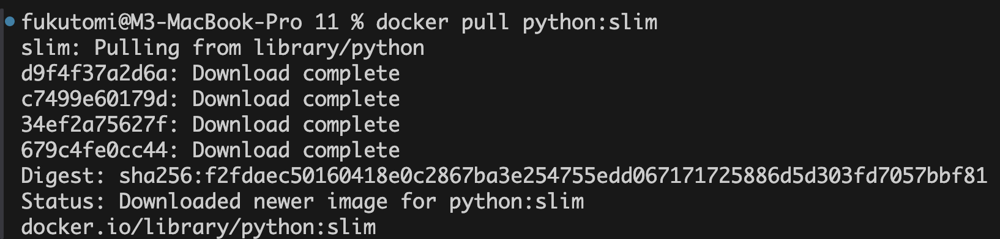
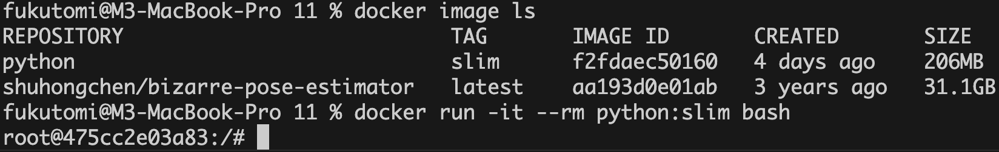
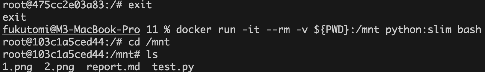
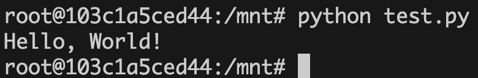
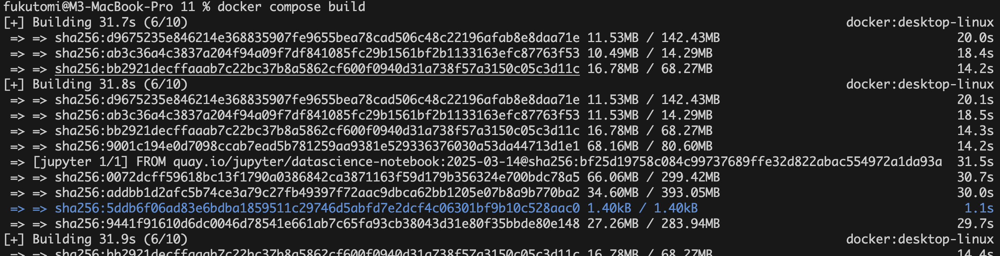
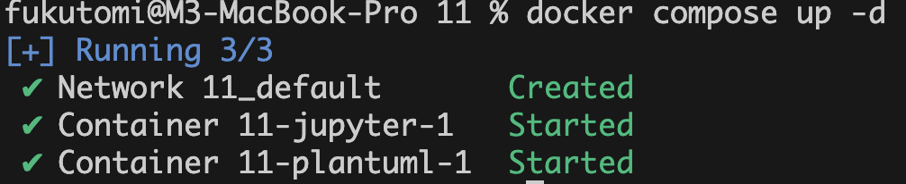
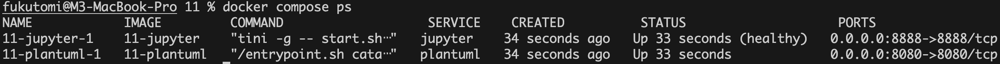

# ソフトウェア工学 レポート課題11

<div style="text-align: right;">
2025年5月29日授業分  <br>
学籍番号：35714121  <br>
名前：福富隆大  <br>
<br>
</div>

## 課題11-1：コンテナ環境での実行

実行したPythonプログラム

```python
print("Hello, World!")
```

---



 Dockerイメージをダウンロードするコマンドを実行

---



 イメージの一覧を確認するコマンドとコンテナを起動するコマンドを実行

---



 コンテナをマウントするコマンドを実行

---



 コンテナ内でPythonプログラムを実行するコマンドを実行

 ---

## 課題11-2：docker-compose.ymlの作成と検証

docker-compose.yml

```yaml
services:
  jupyter:
    build: ./jupyter 
    ports:
      - "8888:8888" 
    volumes:
      - ./:/home/jovyan/work 

  plantuml:
    build: ./plantuml 
    ports:
      - "8080:8080" 
```

Dockerfile(jupyter)

```dockerfile
FROM quay.io/jupyter/datascience-notebook:2025-03-14
```

Dockerfile(plantuml)

```dockerfile
FROM plantuml/plantuml-server:tomcat
```



 docker compose buildを実行してイメージをビルド

 ---

 

 docker compose up -d を実行してコンテナを起動

 ---

 

 docker compose ps を実行してコンテナの状態を確認
