# ソフトウェア工学 レポート課題12~13

2025年6月12日, 6月19日授業分   
学籍番号：35714121   
名前：福富隆大   
 

## 課題12-13-1：Gitを用いたバージョン管理

### GitHub に新しいリポジトリを作成する

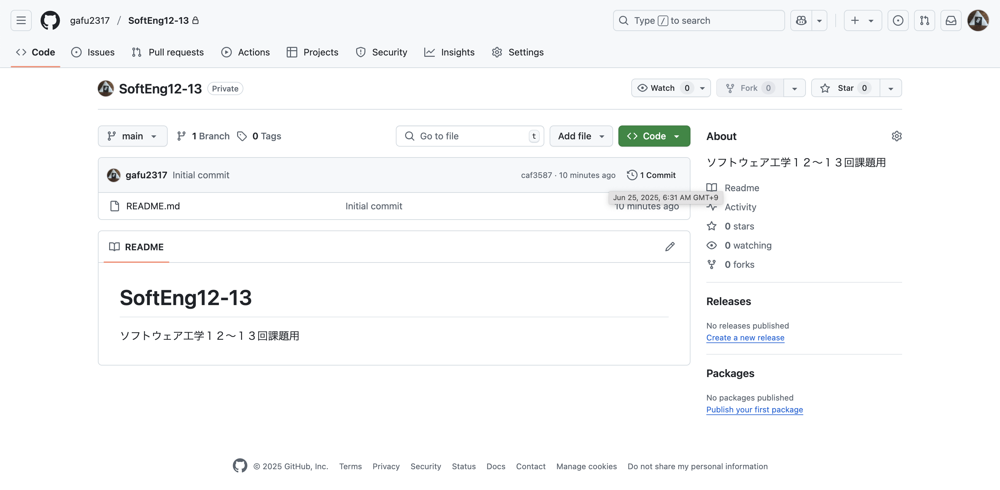

説明:SoftEng12-13と言う名前のリポジトリを作り、README.mdを作成した。

### ローカル環境にクローン（git clone）する

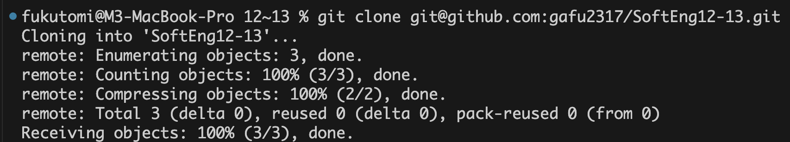

説明:コマンドを使用して、sshを用いてGitHubに接続し、リポジトリをクローンした。

### ファイルを作成し，git add と git commit を実行する

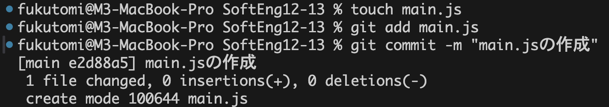

説明:コマンドを使用しaddとcommitを実行した。コミットメッセージは一目で内容が分かるように簡潔にした。

### ファイルを複数回修正し，その都度 add と commit を行う

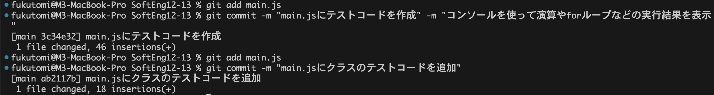

説明:先ほどのコマンドを使用して、ファイルを複数回修正し、その都度addとcommitを実行した。コミットメッセージは一目で内容が分かるように簡潔にした。

### 新しいブランチを作成し，そのブランチに対しても commit を行う

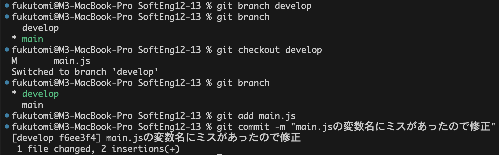

説明:コマンドを使用して、新しいブランチを作成し、そのブランチに移動してcommitを実行した。コミットメッセージは一目で内容が分かるように簡潔にした。

### すべての追加・修正内容をGitHubリポジトリにgit push を実行する

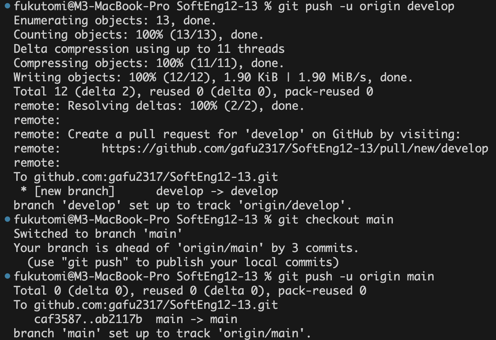

説明:コマンドを使用して、最初のpushなのでuオプションを使用し、すべての追加・修正内容をGitHubリポジトリにpushした。

## 12-13-2：GitHubにおけるPRとissue

### issueを作成する

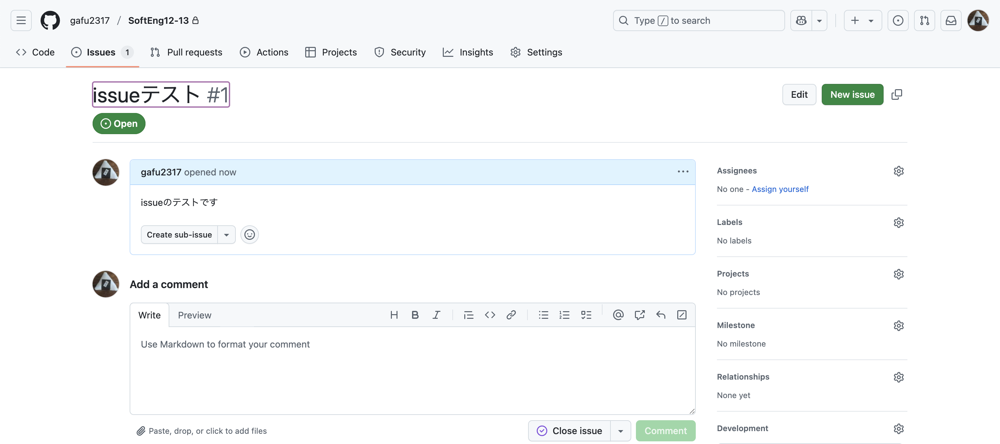

説明:issueテストという名前のissueを作成した。

### 新しいブランチを作成し，修正内容を反映する

説明:ブランチは先ほど作成したものを使い、先ほどした修正をissueの修正とする。

### 作成したissueに紐づけたPull Request（PR）を作成する

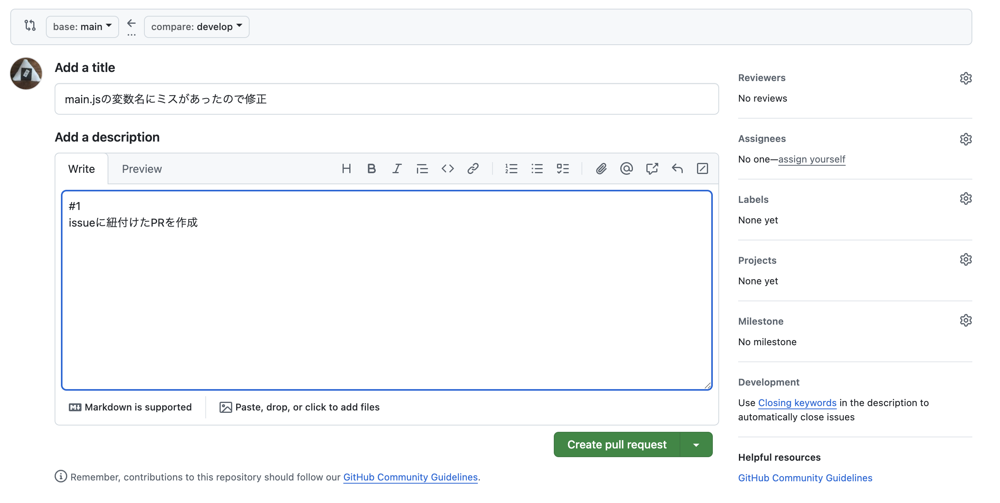

説明:

### PRをマージし，issueのクローズを確認する

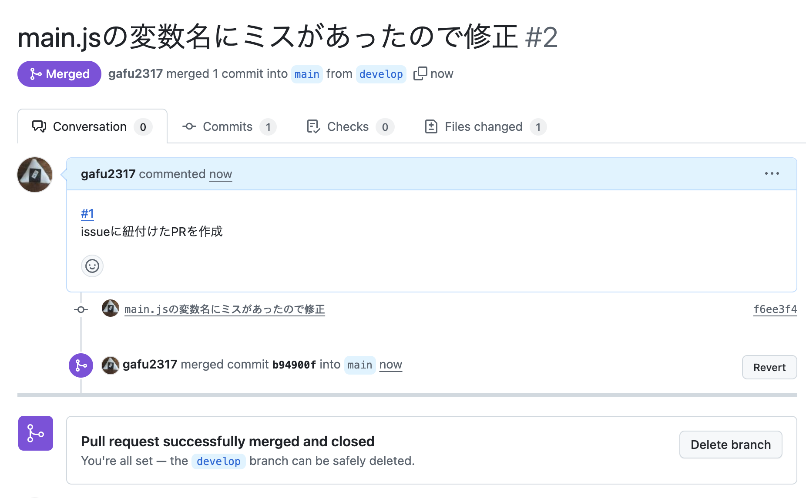
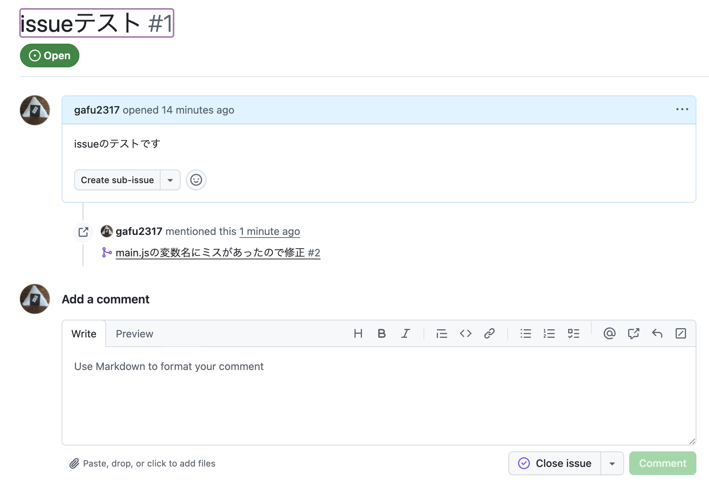
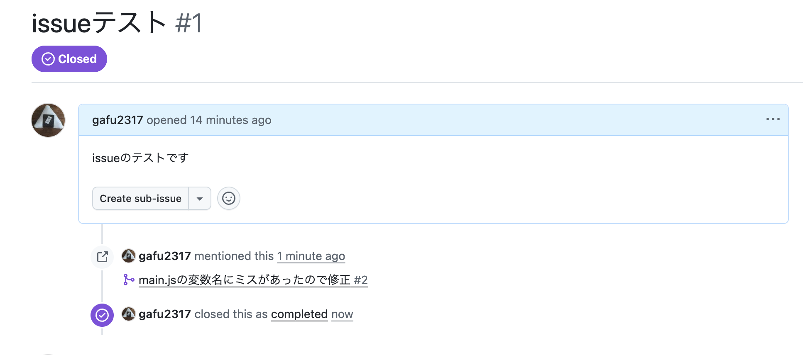

説明:issueを紐づけてPRを作成し、マージした。その後issueをクローズした。

## 感想

自分はgit,GitHub自体はは使ったことがあったのですが、issueを活用しきれていませんでした。  
講義でissueのメリットを学べたのでこれをきっかけにissueを活用していきたいと思います。
