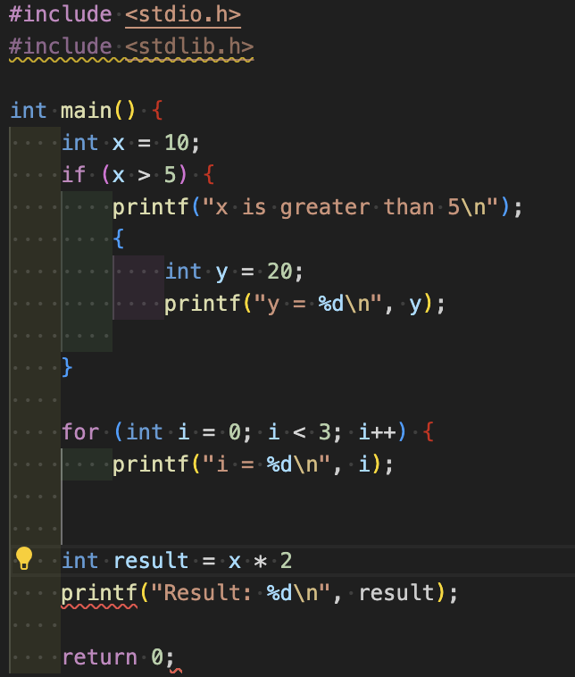
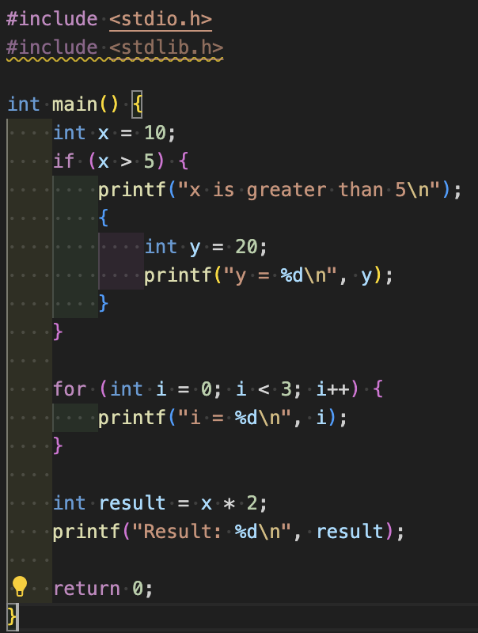
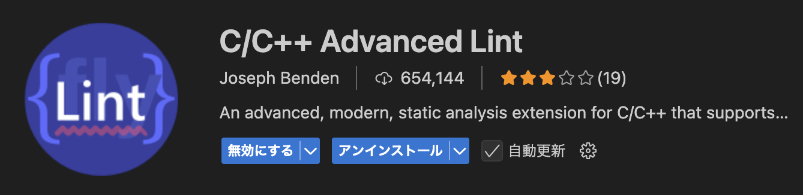
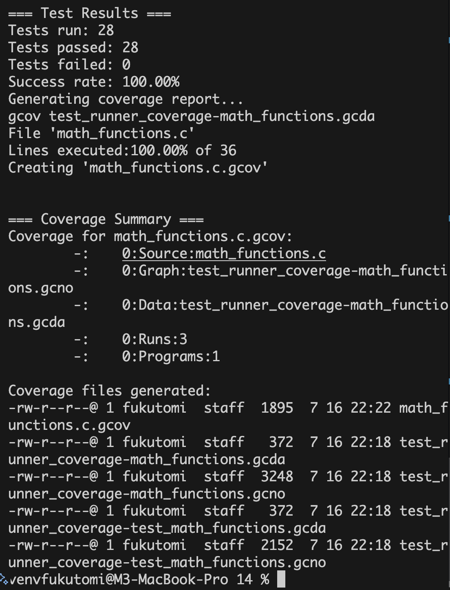

# ソフトウェア工学 レポート課題14

<div style="text-align: right;">
2025年7月10日授業分<br>
学籍番号：35714121<br>
名前：福富隆大<br>
</div>

## 1. 静的解析ツールによるコード診断

### 1.1 コード診断の結果

静的解析ツールによる診断の結果、最後の閉じ括弧`}`が不足していることが判明しました。



**エラー内容：** 最後の`}`がなくて構文エラーが発生している。

### 1.2 修正内容

不足していた最後の`}`を追加することで、構文エラーを解決しました。



**修正方法：** 最後の行に`}`を追加

### 1.3 使用ツール

**開発環境：** VSCode

**使用した拡張機能：**



## 2. ユニットテストの実装とカバレッジ確認

### 2.1 ユニットテストの実行結果



### 2.2 カバレッジ確認

gcovを使用してコードカバレッジを測定した結果、以下の通りでした：

```
-:    0:Source:math_functions.c
-:    0:Graph:test_runner_coverage-math_functions.gcno
-:    0:Data:test_runner_coverage-math_functions.gcda
-:    0:Runs:3
-:    0:Programs:1
-:    1:#include "math_functions.h"
-:    2:
 9:    3:int add(int a, int b) {
 9:    4:    return a + b;
-:    5:}
-:    6:
 9:    7:int subtract(int a, int b) {
 9:    8:    return a - b;
-:    9:}
-:   10:
 9:   11:int multiply(int a, int b) {
 9:   12:    return a * b;
-:   13:}
-:   14:
12:   15:int divide(int a, int b) {
12:   16:    if (b == 0) {
 3:   17:        return -1;
-:   18:    }
 9:   19:    return a / b;
12:   20:}
-:   21:
24:   22:int factorial(int n) {
24:   23:    if (n < 0) {
 3:   24:        return -1;
-:   25:    }
21:   26:    if (n == 0 || n == 1) {
 9:   27:        return 1;
-:   28:    }
12:   29:    return n * factorial(n - 1);
24:   30:}
-:   31:
18:   32:int is_prime(int n) {
18:   33:    if (n < 2) {
 6:   34:        return 0;
-:   35:    }
21:   36:    for (int i = 2; i * i <= n; i++) {
12:   37:        if (n % i == 0) {
 3:   38:            return 0;
-:   39:        }
 9:   40:    }
 9:   41:    return 1;
18:   42:}
-:   43:
177:   44:int fibonacci(int n) {
177:   45:    if (n < 0) {
 3:   46:        return -1;
-:   47:    }
174:   48:    if (n == 0) {
36:   49:        return 0;
-:   50:    }
138:   51:    if (n == 1) {
57:   52:        return 1;
-:   53:    }
81:   54:    return fibonacci(n - 1) + fibonacci(n - 2);
177:   55:}
```

### 2.3 カバレッジ結果の分析

- **add関数**: 9回実行され、すべての行がカバーされている
- **subtract関数**: 9回実行され、すべての行がカバーされている
- **multiply関数**: 9回実行され、すべての行がカバーされている
- **divide関数**: 12回実行され、ゼロ除算の分岐も適切にテストされている
- **factorial関数**: 24回実行され、負数、0、1、および再帰的計算がテストされている
- **is_prime関数**: 18回実行され、素数判定のすべての分岐がテストされている
- **fibonacci関数**: 177回実行され、負数、0、1、および再帰的計算がテストされている

## 3. まとめ

静的解析ツールを使用することで、コンパイル前に構文エラーを早期発見できました。また、ユニットテストとカバレッジ測定により、実装したすべての関数が適切にテストされ、エラーハンドリングも含めて十分なカバレッジが得られていることを確認できました。

このようなテスト駆動開発のアプローチにより、コードの品質向上と保守性の確保が可能になります。